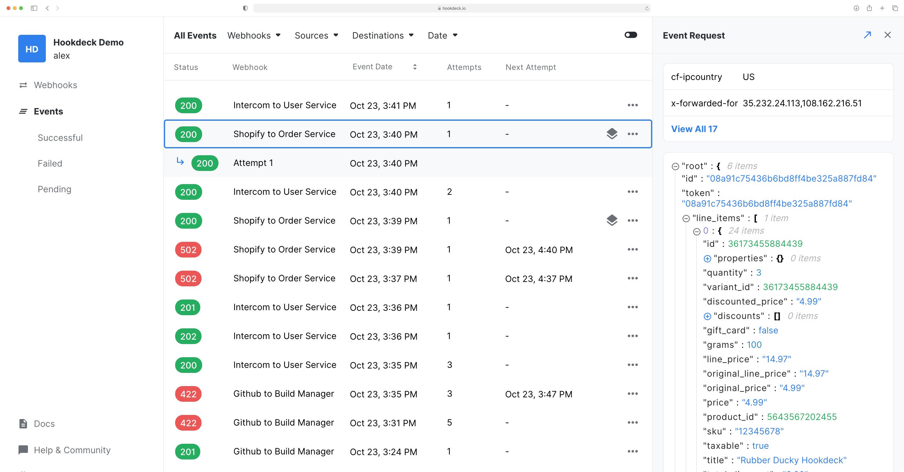

## Events list

The event list displays the historical record of your events by descending order. Each even can be selected to preview the event request data and the reponse data. By default, when selecting an even, the most recent attempt is used to populate the response data but any other attempt can also be selected.

### Filtering & Sorting

You can filter events by:

- **Status**: By the returned HTTP status of the event.
- **Webhooks**: By specific Webhooks.
- **Sources**: By the source of the events.
- **Destinations**: By the destination of the events.
- **Date**: By a specific or interval of dates.

You can sort events by:

- **Created At**: The date the event was received.
- **Last Attempt At**: The date the last attempt was made.

### Paging

The event list display up to 50 events at any given time, you can travel back and forth in time but using the `Previous` and `Next` buttons at the bottom of the list. Because Hookdeck uses cursor pagination, navigating betwen pages will not be impacted by new incomming events, event with live update turned on.

## Inspect request and response

Inspecting event request data and attempt response data is very practical to troubleshoot issues. For each event for the request `Headers` and `Body` is provided either as plan text or JSON. For the attempt the Status Code and the response `Body` is displayed.

:::tip
You can open the JSON documents in fullscreen!
:::

## Statuses

### HTTP response codes

When you destination respon with a valid HTTP response code, it's displayed as the status.

A response code within 2XX is considered succesful, a status code above 4XX is considered a failure.

### Error codes

If your destination was unreachable or failed to respond you will see the `ERR` code. A more specific error code can be found by clicking on the event.

The possible codes are:

- **CONNECTION_REFUSED**: The request to your destination could not be made because the connection was refused
- **CONNECTION_RESET**: The request to your destination could not be made because the connection was forcibly closed by your server.
  break;
- **NOT_FOUND**: The request to your destination could not be made because the domain or host was not found or unavailable.;
- **TIMEOUT**: The request to your destination exceeded the 30 seconds timeout. The request might have still been processed on your destination.
- **UNKNOWN**: A uncategorized error occured. If one those error is triggered, the technical team is notified and will investigate the situation.
