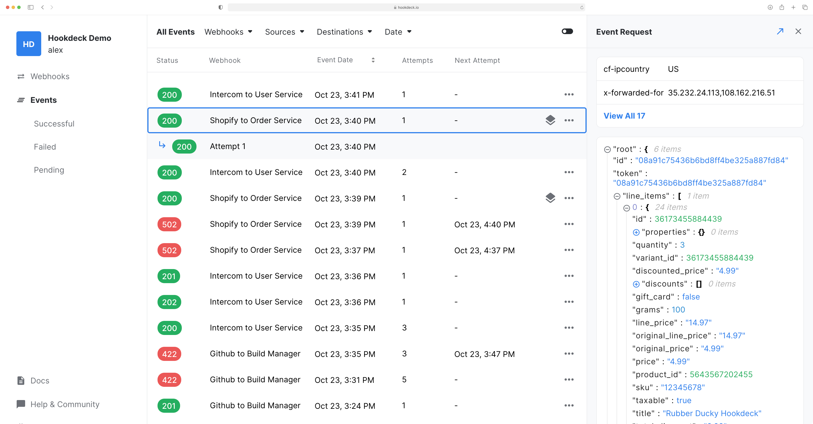

import Tabs from "@theme/Tabs";
import TabItem from "@theme/TabItem";

## Events list

The event list displays the historical record of your events in descending order. Each event can be selected to preview the event request data and response data. By default, when selecting an event, the most recent attempt is used to populate the response data. You can also select any of the other attempts.



### Filtering & Sorting

You can filter events by:

- **Status**: By the returned HTTP status of the event.
- **Webhooks**: By specific Webhooks.
- **Sources**: By the source of the events.
- **Destinations**: By the destination of the events.
- **Date**: By a specific or interval of dates.
- **Request**:
  - **Body**: By partial JSON match of the request body.
  - **Headers**: By partial JSON match of the request headers.

You can sort events by:

- **Created At**: The date the event was received.
- **Last Attempt At**: The date the last attempt was made.

#### Examples

<Tabs
  defaultValue="dashboard"
  values={[
    { label: 'Dashboard', value: 'dashboard', },
    { label: 'API', value: 'api', },
  ]
}>
<TabItem value="dashboard">

*Filter by sources*


*Filter by request body*


</TabItem>
<TabItem value="api">

``` title="Filter by multiple sources"
GET https://api.hookdeck.io/events?source_id[0]=src_xxx&source_id[1]=src_yyy
```

``` title="Filter by request body with key "hello" and value "world""
GET https://api.hookdeck.io/events?body=%7B%20"hello"%3A%20"world"%20%7D
```

[API reference →](https://docs.hookdeck.io/#retrieve-all-events)

</TabItem>
</Tabs>

### Paging

The event list displays up to 50 events at any given time. You can travel back and forth using the `Previous` and `Next` buttons at the bottom of the list. Hookdeck uses cursor pagination thus navigating between pages will not be impacted by new incoming events when the live update is turned on.

## Inspect request and response

Inspecting event request data and attempt response data is very practical to troubleshoot issues. For each event, the request `Headers` and `Body` are provided either as plain text or JSON. For the attempt, the Status Code and the response `Body` is displayed.

:::tip
You can open the JSON documents in fullscreen!
:::

## Statuses

### HTTP response codes

When your destination responds with a valid HTTP response code, it will be displayed as the status.

A response code within 2XX is considered successful while a status code above 4XX is considered a failure.

### Error codes

If your destination was unreachable or failed to respond, you will see the `ERR` code. A more specific error code can be found by clicking on the event.

The possible codes are:

- **CONNECTION_REFUSED**: The request to your destination could not be made because the connection was refused.
- **CONNECTION_RESET**: The request to your destination could not be made because the connection was forcibly closed by your server.
- **NOT_FOUND**: The request to your destination could not be made because the domain or host was not found or unavailable.
- **TIMEOUT**: The request to your destination exceeded the 30 seconds timeout. The request might have still been processed by your destination.
- **UNKNOWN**: A uncategorized error occurred. If one of these errors is triggered, the technical team is notified and will investigate the situation.
