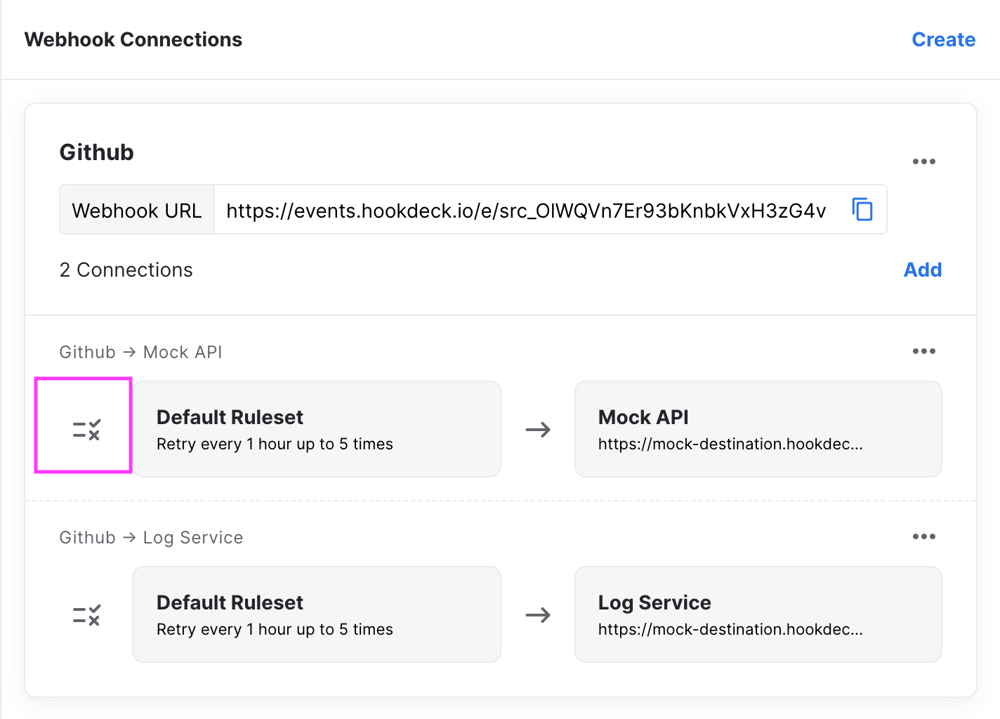
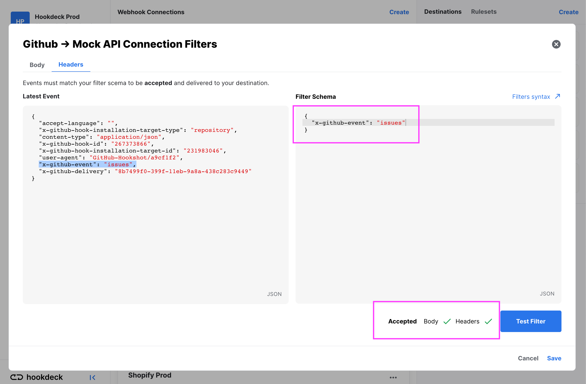
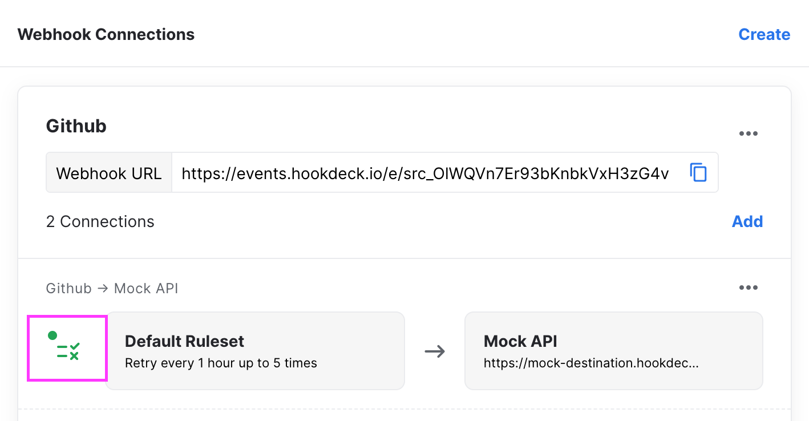

Hookdeck support filtering the webhooks events that are processed and sent to your destination. Events can filtered using the JSON filtering syntax. Filters can be applied to both the request `Headers` and `Body`

:::tip
In some cases we have seen upward of 99% of webhook events being filtered, you can drastically reduce the number of request to your servers depending of your use case.
:::

## Set or Update filters

Filters are defined on a `Webhook Connection`. Within the UI you can edit or update your filter by clicking the _Filters icon button_



Within the modal, on left side you'll have a reference of the last event for that connection and on the right, a JSON editor to enter your filter.

You can add filters for both the `Body` and the `Headers`, both must fit an event for it to be accepted.

Once you have edited your filter you can select _Test Filter_ to test your filter againsts the latest event to make sure the result is what you intended.

_Example filter to receive only 'issues' webhook type from Github_




Once a filter is active, it will be shown next to the connection



:::tip
You can version control your filters by creating or updating your connection from your server or CD & CI pipeline with the Admin API.
:::

## Filter Syntax

Filters support `JSON` or raw `string` `boolean` `number` and `null` .

For example this event would be **filtered**

```js
// Event request body
false;
```

```js
// Filters
false;
```

JSON filter supports matching on any value (`string` `number` `boolean` `null`), on nested objects and on arrays.

### Simple primitives

For example you can also use the filter to events of only a given type

```json
{
  "type": "order/created",
  "order": {
    "id": 123
  }
}
```

```json
{
  "type": "order/created"
}
```

### Nested Objects

For example if you wanted to receive all events where the product inventory is 0, you would:

```json
{
  "product": {
    "title": "A product",
    "inventory": 0
  }
}
```

```json
{
  "product": {
    "inventory": 0
  }
}
```

### Arrays

Arrays are always matched partially. It's effectively the same as `contains`

```json
{
  "product": {
    "title": "Gift Card",
    "tags": ["gift", "something"]
  }
}
```

```json
{
  "product": {
    "tags": "gift"
  }
}
```

You can also match multiple items (they must all be contained)

```json
{
  "product": {
    "title": "Gift Card",
    "tags": ["gift", "something", "another"]
  }
}
```

```json
{
  "product": {
    "tags": ["gift", "something"]
  }
}
```

Or even nested objects

```json
{
  "order": {
    "id": 123,
    "items": [
      {
        "id": 456,
        "title": "My product"
      }
    ]
  }
}
```

```json
{
  "order": {
    "items": {
      "id": 456
    }
  }
}
```

### Operators

Sometimes you need more than simple a `equal` matching. Our syntax support different operators to allow for more complex matching strategies.

Operators can be used as an object instead of the matching value

```json
{
  "product": {
    "title": "A product",
    "inventory": 5
  }
}
```

```json
{
  "product": {
    "inventory": {
      "$lte": 10
    }
  }
}
```

#### All operators

| Operator    | Supported Type                | Description                   |
| ----------- | ----------------------------- | ----------------------------- |
| $gte        | number, string                | Greater than or equal to      |
| $gt         | number, string                | Greater than                  |
| $lt         | number, string                | Less than                     |
| $lte        | number, string                | Less than or equal to         |
| $eq         | array, number, object, string | Equal (or deep equal)         |
| $neq        | array, number, object, string | Not Equal (or deep not equal) |
| $in         | array, string                 | Contains                      |
| $nin        | array, string                 | Does not contain              |
| $startsWith | string                        | Starts with text              |
