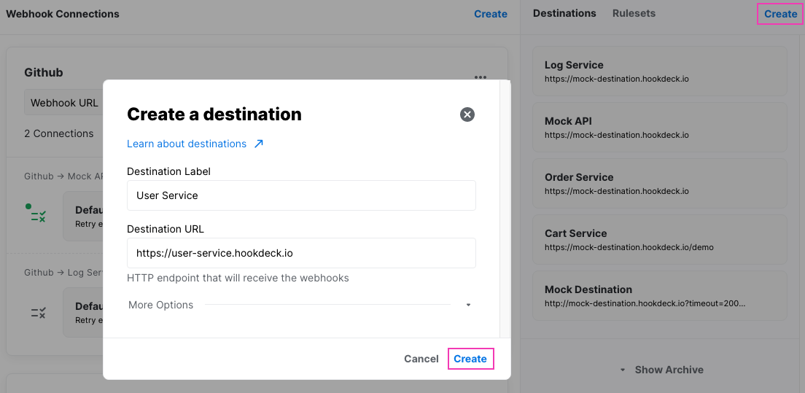
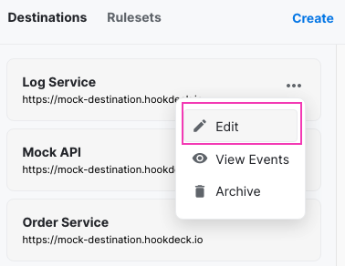
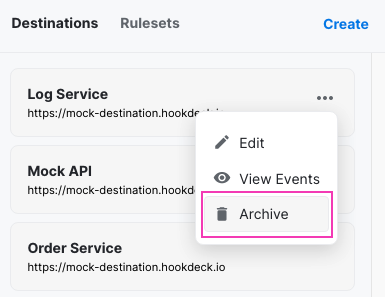
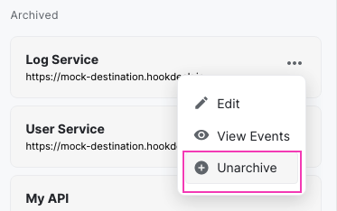

## What's a Destination

A [`Destination`](destinations) is used to define the URL where your webhooks should be sent. Generally, this should be labeled after the service or a specific method on your service. For example, "Order Service", "Internal API" or "Update Order".

Each [`Destination`](destinations) has a webhook URL which is the endpoint Hookdeck will be sending HTTP `POST` requests. The original request headers and the data are preserved. Additionally, Hookdeck will also append metadata to the request.

:::note
Be as descriptive as possible, it will help you keep track of your webhook events!
:::

## Receiving webhook events

To receive your webhook events you will need an HTTP server listing on a given endpoint for HTTP POST request accepting `Content-Type`: `application/json`

A simple NodeJS implementation using [ExpressJS](https://expressjs.com/) would be

```javascript
const express = require("express");
const app = express();
const port = 3000;

app.post("/webhooks", (req, res) => {
  res.send("Server receive a webhook!");
});

app.listen(port, () => {
  console.log(`Example app listening at http://localhost:${port}`);
});
```

### Request headers

Hookdeck preserves the original HTTP headers.

However, we remove "noisy" headers created by our own infrastructure as well as append the following headers:

```json
X-Hookdeck-EventID:        Hookdeck event id
X-Hookdeck-Attempt-Count:  Event attempt count
X-Hookdeck-Event-URL:      URL to the Hookdeck Dashboard for that event
```

### Resquest body

Hookdeck preserves the original HTTP request body. However, since Javascript doesn't have support for 64-bit integers, very large numbers (58 bits +) will be converted to a string to preserve their original values.

### Responding to the event

When using Hookdeck, it's recommended to respond to a webhook event request with a status code that reflects the actual state of your system. When an operation is processed, you should respond with a `2XX` response code (`200`, `201`) for successes or a `4XX - 5XX` for errors.
We recommend you return the most relevant status code to help you with troubleshooting.

Contrary to what you might have been doing in the past, when using Hookdeck you should not simply return an HTTP 200 (success) right away and queue the event. You should take action immediately and report the result back to Hookdeck. This is what enables Hookdeck to know what events to retry as well as providing you with the tools to recover from errors.

Another common practice is to abstract errors into a generic `500` fatal error. While this is done to not leak stack traces or other important information, when using Hookdeck over `HTTPS` (SSL) the more specific the error you return, the more helpful Hookdeck will be to solve your errors.

Using our previous NodeJS example

```javascript
app.post("/webhooks", (req, res) => {
  try {
    const result = doSomething(req.body);
    // Webhook handled succesfully, let Hookdeck know.
    res.status(200).json(result);
  } catch (e) {
    // Oh no something went wrong, provide Hookdeck with the error.
    res.status(500).json(e);
  }
});
```

### Timeouts

When Hookdeck delivers an event to your destination, it will wait for up to 30 seconds for a response before timing out. Attempts that timeout will be shown as `ERR` in the dashboard with the status code `TIMEOUT`. They are considered as `failed` and eligible for retry.

If you run into problems with the 30 seconds timeout, please reach out to us, we can increase it!

## Create a Destinaton

To create a [`Destination`](destinations) follow these two steps:



:::tip
A new destination can also be created when creating a new `Webhook Connection`
:::

## Edit a Destination

You can edit a [`Destination`](destinations) by selecting the edit button from the destination card options menu:



:::info
After editing a [`Destination`](destinations) ULR, all pending and new webhook events will now be sent to that URL
:::

## Archive a Destination

You have the option to archive a [`Destination`](destinations) you do not use anymore.

:::note
You can only archive Destination that is not linked with any webhook connections.
:::



You can unarchive a [`Destination`](destinations) if you decide to want to use it again.


