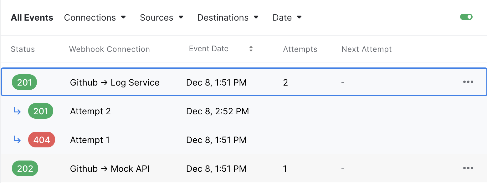

## What's an event?

An event is represent a webhook received from one of your source. Events are used to keep track of all the webhook received and their state.

- **Status**: The event status (pending, failed or successful)
- **Event Date**: The date the event was received
- **Attempts**: The count of attemps that has been made
- **Webhook Connection**: The webhook connection the event is associated to
- **Next Attempt At**: Automatically scheduled date for the next retry (attempt) to be made

Each event also as an associated `Event Request` that contains the `Headers` and `Body` of the original webhook request.

The `Headers` is a `JSON` document and the `Body` can be a simple primitive (`boolean`, `string`, `number`, `null`) or `JSON`

:::info
If you have multiple webhook connections for your source, for each webhook we will create as many event as there is connections.
:::

## What's an attempt?

For each Event, an intial attempt is made to deliver the request to your [`Destination`](destinations). If the request is succesful or the retry strategy is disabled, your event will only have a single attempt.

Alternatively new attempts will be made over time according to your retry strategy. Any given event can have up to 50 attempts. Each attempt can be browsed within the Event List by clicking any given event or by going directly to the page.

- **Status**: The attempt status (pending, failed or successful)
- **Attempt Date**: The date the attempt was made
- **Attempt Number**: The number of the attempt (nth position) for the associated event

Each attempt also as an associated `Attempt Response` that contains the `HTTP Status` and `Body` of the server response.

### Error codes

If your destination was unreachable or failed to respond you will see the `ERR` code. A more specific error code can be found by clicking on the event.

The possible codes are:

- **CONNECTION_REFUSED**: The request to your destination could not be made because the connection was refused
- **CONNECTION_RESET**: The request to your destination could not be made because the connection was forcibly closed by your server.
  break;
- **NOT_FOUND**: The request to your destination could not be made because the domain or host was not found or unavailable.;
- **TIMEOUT**: The request to your destination exceeded the 30 seconds timeout. The request might have still been processed on your destination.
- **UNKNOWN**: A uncategorized error occured. If one those error is triggered, the technical team is notified and will investigate the situation.
