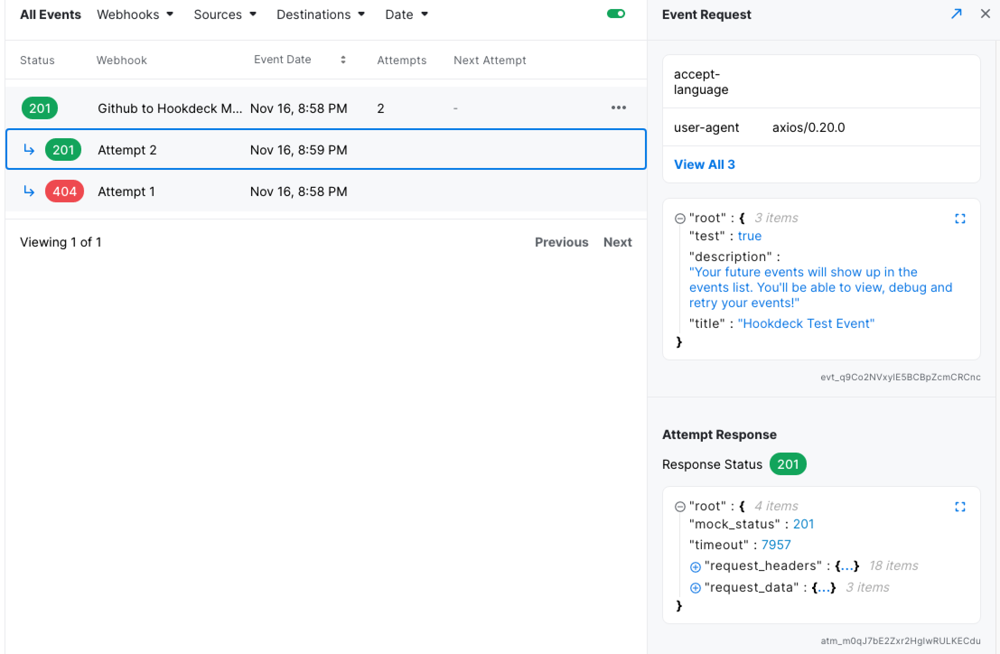

## Sign up

Create your account at https://dashboard.hookdeck.io/signup

We support authentication by SSO with `Google` and `Github` along with passwordless signin by `Email`

## Create your workspace

Upon signup you will be prompted to create your first `Deck` which is commonly refered to as `Workspace`.

Enter your Deck name and fill in the form.

---

## Create a webhook connection

There is two ways to create a webhook connection:

- Using the onboarding process (https://dashboard.hookdeck.io/onboarding)
- Using the API

:::note
For our example project, we will be using the first method by leveraging the right-hand side of the screen to create a source, a destination and a ruleset.
:::

The onboarding will guide your through creating your first webhook connection.

### Create a Source

A source is a representation of the service your are planning on receiving your webhooks from. That could be Shopify, Github, Olark, Stripe or any other service.

_For our example project, we will create a Github Source._

### Create a Destination

A destination is a representation of your own API where the webhooks will be delivered. Each destination requires a HTTP URL that will receive a POST request with a JSON body payload. Each webhook event will also cont

_For our example project, we will create a Hookdeck Mock Destination._

### Create a Ruleset

A ruleset is a reusable set of configuration to set the retry logic and alert logic for any event associated with a webhook.

- The retry logic consists of a `retry count` and a `retry interval`. The `retry count` is the number of automatic retry for a failed event and the `retry interval` is the time between each automatic retry.
- The alert logic uses at the `alert strategy` and the `alert interval`. The `alert strategy` defines the condition for which you wish to receive an email alert and the `alert interval` is the minimum time between each email alert.

:::info
Each workspace has a Default Ruleset that's configured with sensible defaults.
:::

_For our example project, we will use the Default Ruleset that will retry every hour minutes up to 5 times. It will send an email alert for the last failure, with up to 1 email per hour._

## Update the endpoint in the Source

Hookdeck generates a unique URL for each `source`. Replace your current endpoint in your `Source` with Hookdeck's URL.

_For our example project, I will update the URL in the config of my GitHub webhook._

_Github Webhooks UI_

---

## Validate the connection

After replacing the endpoint for Hookdeck's URL. Trigger an action in your source to validate the webhook connection.

:::info
You can send a test event from Hookdeck's dashboard
:::

_Our first event! 🎉_

---

## Congratulations!

You created your first webhook connection. You now have full visibility on incoming calls and the tools to troubleshoot errors. You can sit back while Hookdeck reliably handles and delivers your webhooks.

:::tip
You can now create as many connections as you want with the Dashboard or the API
:::
