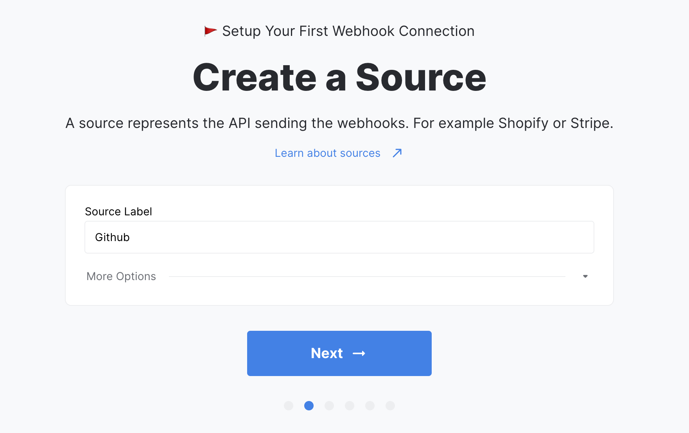
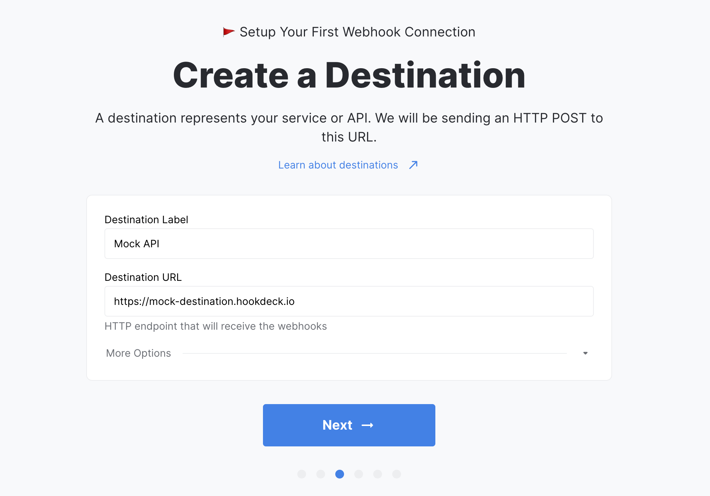
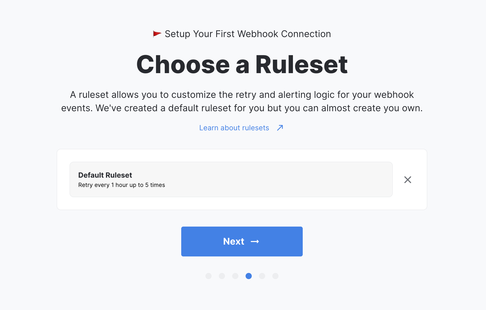
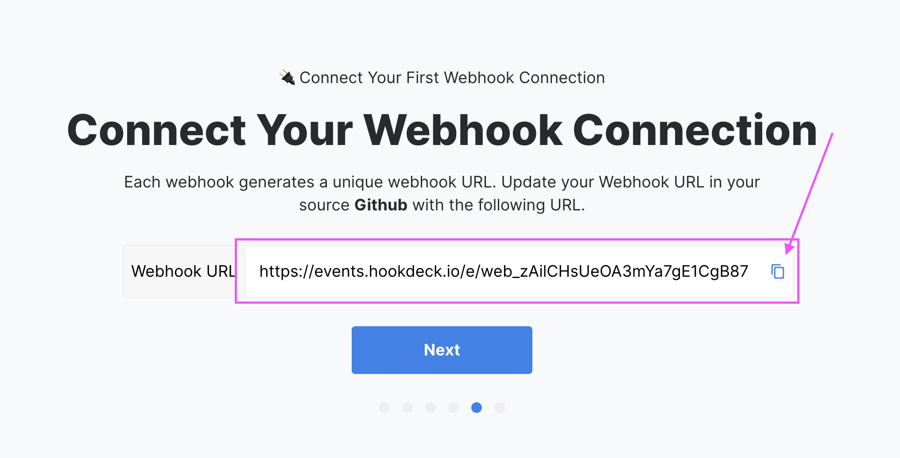
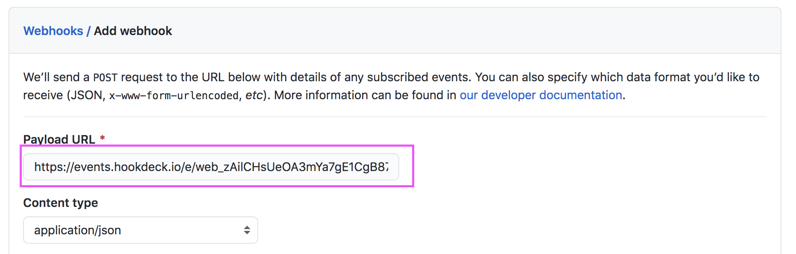

import Tabs from "@theme/Tabs";
import TabItem from "@theme/TabItem";

## Sign up

Create your account at https://dashboard.hookdeck.io/signup

We support authentication by SSO with `Google` and `Github` along with passwordless sign in by `Email`

## Create your workspace

Upon signing up you will be prompted to create your first `Workspace`.

Enter your workspace name and fill in the form.

---

## Create a webhook connection

<Tabs
  defaultValue="dashboard"
  values={[
    { label: 'Dashboard', value: 'dashboard', },
    { label: 'API', value: 'api', },
  ]
}>
<TabItem value="dashboard">

The onboarding will guide you through creating your first webhook connection.

### Create A Source

A [`Source`](sources) is a representation of the service you are planning on receiving your webhooks from. That could be Shopify, Github, Olark, Stripe, or any other service.

_For our example project, we will create a Github Source._



### Create a Destination

A [`Destination`](destinations) is a representation of your own API where the webhooks will be delivered. Each destination requires an HTTP URL that will receive a POST request with a JSON body payload. Each webhook event also contains Hookdeck metadata.

_For our example project, we will create a Hookdeck Mock Destination._



### Create a Ruleset

A ruleset is a reusable set of configurations to set the retry logic and alert logic for any event associated with a webhook.

- The retry logic consists of a `retry count` and a `retry interval`. The `retry count` is the number of automatic retry for a failed event and the `retry interval` is the time between each automatic retry.
- The alert logic uses the `alert strategy` and the `alert interval`. The `alert strategy` defines the condition for which you wish to receive an email alert and the `alert interval` is the minimum time between each email alert.

:::info
Each workspace has a Default Ruleset that's configured with sensible defaults.
:::

_For our example project, we will use the Default Ruleset that will retry every hour minutes up to 5 times. It will send an email alert for the last failure, with up to 1 email per hour._




</TabItem>
<TabItem value="api">

You can create your first connection using the API

```
 POST https://events.hookdeck.io/webhooks
```
```json
 {
   "source": {
     "label": "Shopify"
   },
   "destination": {
     "label": "My API",
     "url": "https://myapi.example.com/webhook"
   }
 }
```

```bash title="Using cURL"
curl "POST https://api.hookdeck.io/webhooks" \
  -H "Authorization: Basic {{ BASE64_API_TOKEN }}" \
  -H "Content-Type: application/json"
  --data '{"source":{"label":"Shopify"},"destination":{"label":"My API","url":"https://myapi.example.com/webhook"}}'
```

[API reference →](https://docs.hookdeck.io/#create-a-connection)

</TabItem>
</Tabs>

## Update the endpoint in the Source

Hookdeck generates a unique URL for each [`Source`](sources). Replace your current endpoint in your [`Source`](sources) with Hookdeck's URL.

_For our example project, I will update the URL in the config of my GitHub webhook._



_Github Webhooks UI_



---

## Validate the connection

After replacing the endpoint for Hookdeck's URL. Trigger an action in your source to validate the webhook connection.

:::info
You can send a test event from Hookdeck's dashboard
:::

_Our first event! 🎉_


---

## Congratulations!

You created your first webhook connection. You now have a reliable webhook infrastructure along with full visibility on incoming calls and tools to troubleshoot errors. You can sit back while Hookdeck safely handles and delivers your webhooks.

:::tip
You can now create as many connections as you want with the Dashboard or the API
:::
