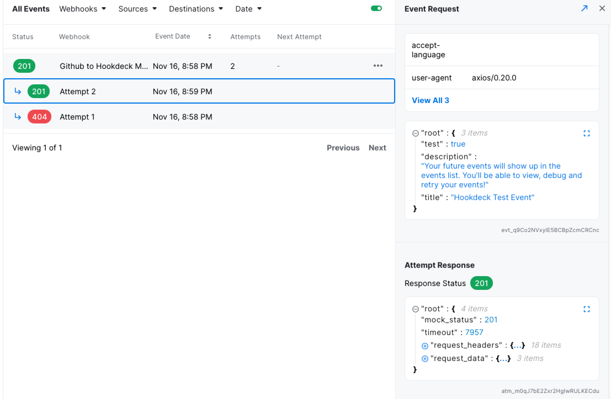

## Manage your deck

After you sign up for Hookdeck (https://dashboard.hookdeck.io/signin), or if you already have registered for an account, you will have a Deck. More information on ["deck" management.](workspaceTeam.md)

---

## Create a webhook connection

We'll take a look at the webhooks tabs from the left sidebar. This is where you can create, edit and archive the elements of your webhook connection. A webhook connection is made of 3 elements. A source, a destination and a ruleset.

There is two ways to create a webhook connection:

- Using the onboarding process (https://dashboard.hookdeck.io/onboarding)
- From scratch by selecting existing elements and/or creating new elements

:::note
For our example project, we will be using the second method by leveraging the right-hand side of the screen to create a source, a destination and a ruleset.
:::

### Create a Source

A source is a representation of the service your are planning on receiving your webhooks from. That could be Shopify, Github, Olark, Stripe or any other service.

_For our example project, we will create a Github Source._

### Create a Destination

A destination is a representation of your own API where the webhooks will be delivered. Each destination requires a HTTP URL that will receive a POST request with a JSON body payload. Each webhook event will also cont

_For our example project, we will create a Hookdeck Mock Destination._

### Create a Ruleset

A ruleset is a reusable set of configuration to set the retry logic and alert logic for any event associated with a webhook.

- The retry logic consists of a retry count and a retry interval. The retry count is the number of automatic retry for a failed event and the retry interval is the time between each automatic retry.
- The alert logic looks at the alert strategy and the alert interval. The alert strategy defines the condition for which you wish to receive an email alert and the alert interval is the minimum time between each email alert.

_For our example project, we will create a Github Ruleset that will retry every 5 minutes up to 15 times. I will receive an email alert for each failure, with up to 1 email per hour._

### Define the webhook connection

You must fill out the form that consists of 4 sections.

1. Define the webhook connection label.
2. Select or create a Source element.
3. Select or create a Destination element
4. Select or create a Ruleset element

:::tip
Hint 1: A good label will help you keep your data organized. A webhook connection label should either represent its intended use such as “Update Products” or its source and destination such as “Shopify To My API.

Hint 2: You can create a Source, Destination and Ruleset from this window.
:::

_For our example project, we will use the elements we previously created. First we will give our webhook connection the label "Github to Hookdeck Mock". Next, we will set our Source as Github, our Destination as Hookdeck Mock Destination and our Ruleset as Github Ruleset._

---

## Update the endpoint in the Source

Hookdeck generates a unique URL for each webhook connection. Replace your current endpoint with Hookdeck's URL.

_For our example project, I will update the URL in the config of my GitHub webhook._

---

## Validate the connection

After replacing the endpoint for Hookdeck's URL. Trigger an action to validate the webhook connection.

:::note
You can send a test event from Hookdeck's dashboard
:::

_For our example project, we validated the connection by sending a test event._

_Result_

---

## Congratulations!

You created your first webhook connection. You now have full visibility on incoming calls and the tools to troubleshoot errors. You can sit back while Hookdeck reliably handles and delivers your webhooks.

:::tip
Repeat the steps as of Create a Webhook Connection to add as many connections you need.
:::
