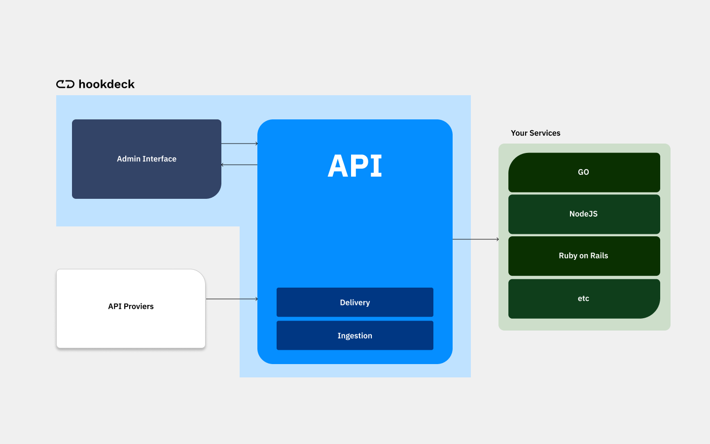
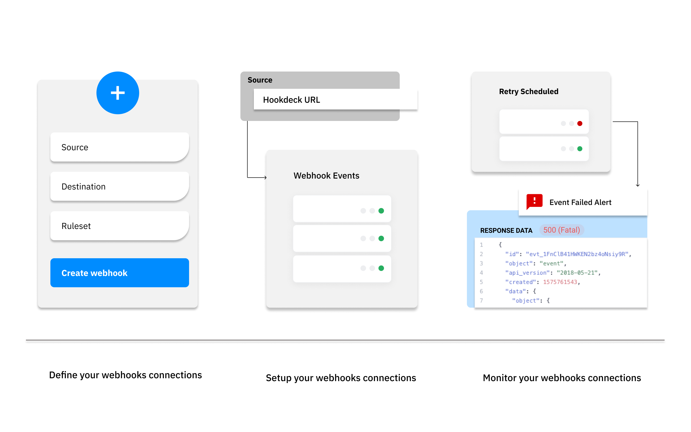

## What is Hookdeck

Hookdeck is the only webhook instrastructure with a UI. It provides developers with all the tooling they need to monitor and troubleshoot webhook events, while enjoying a stable and reliable ingestion and delivery webhook service. It can be also be considered as a plug-and-play queue.

---

## What is a webhook infrastructure

A webhook infrastructure consists of an administration interface for developers, and an API that allows different services to consume events or dispatch events.

Thanks to the reliability from decoupling the ingestion service and the delivery service, you gain the freedom to safely take action on asynchronous communication. Compared to an ordinary queue, a webhook infrastructure has the replayability required to deliver every webhook events.

Hookdeck empowers you to monitor and troubleshoot webhooks from any API Provider. This is a revolutionary approach compared to building a custom solution to handle webhooks for each API provider.

---

## How does Hookdeck work?

Developers can now focus on providing more value for your customers instead of maintaining a custom backend infrastructure. The management of webhooks can be as easy as these three steps:

- Define your webhooks connection: Define the components of your connection which includes a Source, Destination and Ruleset.
- Setup your webhooks connection:  Replace the destination endpoint with Hookdeck's URL at the Source. Send a test event from the Web App or from the API provider.
- Monitor your webhooks connection: Receive an alert when there's an error and troubleshoot within the webapp.

---

## Components

Hookdeck’s components are divided in two categories: the webhook connections and webhook events. A webhook connection is a label given to the relation between a API provider and your service. Each HTTP POST received from a webhook connection is called a webhook event.

### Webhook connections

A webhook connection includes a Source (the API Provider), a Destination (where the webhook is sent) and a Ruleset (the automatic retry and alert logics). Some examples of webhook connections are "Shopify to Order Created", "Intercom to User Service", "Github to Build Manager" and thousands of other use cases.

### Webhook events

A webhook event is a HTTP POST from the API provider. Each webhook event includes the event's request and an attempt response. An event request includes the header, enriched metadata as well as the untouched payload. The attempt response shows the error code and the error message.

A structure like this allows you to find the information you need to troubleshoot errors in one place, minimizing work and improving productivity,

---

## Requirement & Installation

Hookdeck has no external dependencies. If your system is able to receive HTTP POST requests, you’re ready to go.

### Installation

Since Hookdeck is a SaaS there is no installation process. All you have to do is sign up, log in, and setup your webhooks connections.

### Updated

As already mentioned, Hookdeck is a SaaS (Software as a Service) product. That means we do the heavy lifting for you when it comes to updates and infrastructure. Updates are installed automatically and you won’t have to worry about uptime or broken updates as is often the case with legacy or on-premise systems.

Reliability and stability are part of our core values. To find out more about new features check out our [public roadmap](https://www.notion.so/hookdeck/69276510ee8b48408ca12bdbe60b0ece?v=0c174fdd5d98465db3a74dc9bcdb7df2 "Hookdeck Public Roadmap") and our [changelog](https://www.notion.so/hookdeck/What-s-New-3c48e3ee24264b00874f335241e41928 "Hookdeck Changelog").

### Hookdeck UI Requirements

Hookdeck UI requires a modern web browser. We support the last version of all “evergreen” browsers. The term “evergreen” refers to the release strategy of frequently updating in the background. The major browsers which are covered with this are:

- Chrome
- Edge
- Firefox

Although most of Hookdeck’s features will work in other or older browsers as well, we do not test for bugs or unwanted behaviors on these platforms, and can’t give any support.

:::note
Finally, it’s always possible to use Hookdeck without the UI.
:::
