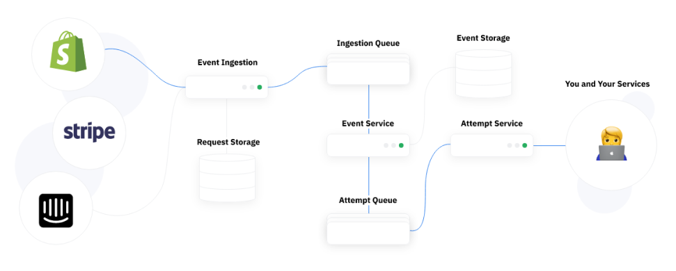
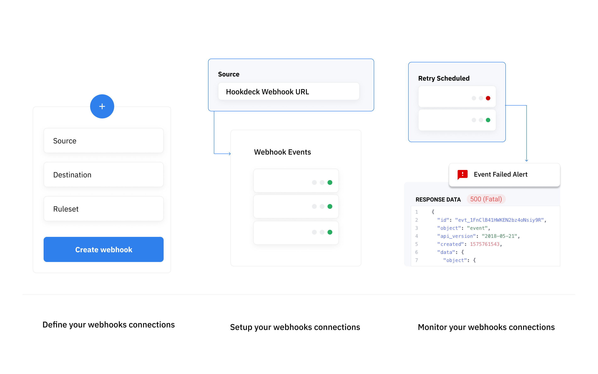

## What's Hookdeck?

Hookdeck is a development and production service that provides developers with all the tooling they need to monitor and troubleshoot webhook events. Benefiting from stable and reliable ingestion and delivery of large volume of webhook.

---

## What's a webhook infrastructure?

When dealing with a large volume of webhooks, the best practices recommend that you build and implement a webhook ingestion infrastructure. The idea of this infrastructure is to delay the processing of webhooks to a later point in time through the use of queues. The reason behind this is to be able to handle large spikes in webhooks since you do not have control of the rate at which you receive webhooks and their content.

A typical infrastructure will feature an ingestion service (AWS Lamba, Cloud Run, etc.), file storage (S3, Cloud Storage, etc.), a queue (SQS, PubSub, RambitMQ, etc.), a set of workers, a monitoring tool, and a scheduler. Hookdeck, on its own, implements all these services into a single product that's plug and play. Hookdeck has built-in support for throttling delivery, storing payloads, handling a large volume of webhook events, retrying webhook events, and alerting logic amongst other things.

We would recommend taking action directly on webhooks received through Hookdeck instead of queuing the message as you would otherwise. Hookdeck implements all the logic you need to safely handle webhooks and recover from errors. You **do not need** to build any additional infrastructure.

Hookdeck empowers you to monitor and troubleshoot webhooks from any API Provider. This is a much less complex approach compared to building a custom solution to handle webhooks for each API provider.

---

## How does Hookdeck work?

Hookdeck works by proxying your webhooks through our own infrastructure. You can now focus on providing more value for your customers instead of maintaining a custom backend infrastructure.

Webhook connections are defined by their [`Source`](sources), [`Destination`](destinations) and [`Ruleset`](rulesets).

- A [`Source`](sources) represent an API sending you a webhook, such as Shopify, Stripe, Github, etc. Each source is assigned a unique _Webhook URL_ that can be provided to the sender.

- A [`Destination`](destinations) represents an endpoint on your own server. Hookdeck will be forwarding all webhooks received to that URL with an HTTP POST request containing the original data from the sender along with additional Hookdeck metadata.

- A [`Ruleset`](rulesets) is a reusable component across your connection to specify what retry logic and alerting logic to apply to your webhook connection.

Hookdeck will ingest any HTTP POST request to your [`Source`](sources) _Webhook URL_ and forward them to your destination URL.

---

## Why use Hookdeck?

### Never miss and webhook again

Hookdeck is a battle tested to handle large volume of webhooks. Reliability is our #1 priority. We protect you against spikes, outages and errors related to unexpected volume increase on your servers.

### Monitor your webhooks

All webhook events received through Hookdeck are monitored and readily available to you via the Dashboard or the API. You can browse the history of every event received which includes the request data and every delivery attempt made with its response data. This allows you to troubleshoot issues and retrace webhook events your systems received.

### Recover from errors

Hookdeck allows you to set a custom retry logic and alerting logic to fit your use case. Along with `Webhook Monitoring` and `Manual Retries`, you are sure to successfully take action on every single webhook event you receive. Let nothing slip through the cracks.

:::info
There are many more reasons to use Hookdeck such as Event Filtering.
:::

---

## Requirement

Hookdeck has no external dependencies. If your system can receive HTTP POST requests, you’re ready to go.

### Installation

Since Hookdeck is a hosted solution, there is no installation process. All you have to do is sign up, and set up your first webhook connection.

### Hookdeck UI Requirements

Hookdeck Dashboard (UI) requires a modern web browser. We support the last version of all “evergreen” browsers. The term “evergreen” refers to the release strategy of frequently updating in the background. The major browsers which are covered with this are:

- Chrome
- Safari
- Edge
- Firefox

Although most of Hookdeck’s features will work in other or older browsers as well, we do not test for bugs or unwanted behaviors on these platforms.

:::info
All of Hookdeck features are available via the API and do not require using the Dashboard.
:::
