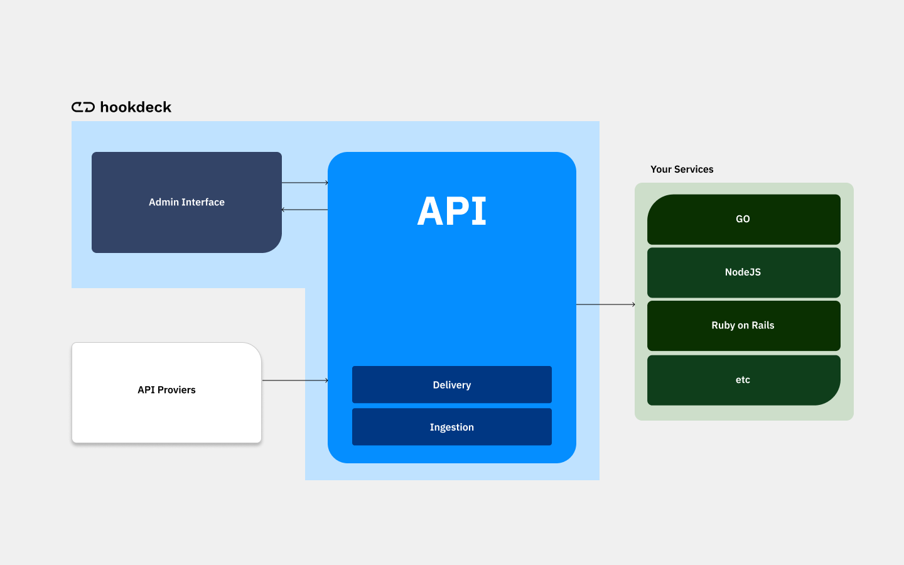
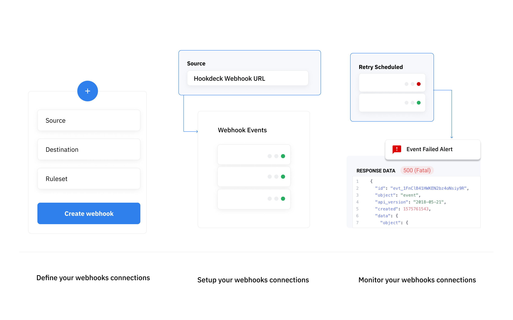

## What's Hookdeck?

Hookdeck is a develoment and production service to provides developers with all the tooling they need to monitor and troubleshoot webhook events, while benefiting from stable and reliable ingestion and delivery of large volume of webhook.

---

## What's a webhook infrastructure?

Generally speaking, when dealing with large volume of webhooks, the best pratices recommend that you build and implement a webhook ingestion infrastructure. The idea of this infrastructure is to delay the processing of webhooks to a later point in time through the use of queues. The is done to be able to handle large spikes in webhooks as you do not have control over the rate at which you receive webhooks and their content.

Generally speaking the typical infrastructure will feature a ingestion service (AWS Lamba, Cloud Run, etc.), file storage (S3, Cloud Storage, etc.), a queue (SQS, PubSub, RambitMQ, etc.), a set of workers a monitoring tool and a scheduler. However, Hookdeck on it's own implements all these services into a single product that's plug and play. Hookdeck has built-in support for throlling delivery, handling large volume of webhooks, custom retry and alerting logic amongst other things.

We generally recommend taking action directly on webhook receive trough Hookdeck instead of queing the message like you otherwise would. Hookdeck implements all the logic you need to safely handle webhooks and recover from errors. You **do not need** to build any additional infrastructure.

Hookdeck empowers you to monitor and troubleshoot webhooks from any API Provider. This is a much less complex approach compared to building a custom solution to handle webhooks for each API provider.

---

## How does Hookdeck work?

Hookdeck works by proxing your webhooks through our own infrastructure. You can now focus on providing more value for your customers instead of maintaining a custom backend infrastructure.

Webhook connections are defined by their `source`, `destination` and `ruleset`.

- A `source` represent an API sending you a webhook, such as Shopify, Stripe, Github etc. Each source is assigned a unique *Webhook URL* that can be provided to the sender.

- A `destination` represent an endpoint on your own server. Hookdeck will be forwarding all webhooks received to that URL with a HTTP POST request containing the original data from the sender along with additional Hookdeck metadata.

- A `ruleset` is a reusable component across your connection to specifiy what retry logic and alerting logic to apply to your webhook connection.

Hookdeck will ingest any HTTP POST request to your `source` *Webhook URL*  and forward them to your destination url.

---

## Why use Hookdeck?

### Never miss and webhook again

Hookdeck is a battle tested to handle large volume of webhooks. Reliability is our #1 priority. We protect you against spikes, outages and errors related to unexpected volume increase on your servers. 

### Monitor your webhooks

All webhooks received by Hookdeck are monitored and readily available to you via the Dashboard or the API. You can the history of every event receive with the request data and every delivery attempts made with the response data. This allows to troubleshoot issues, and retrace the webhooks your systems received.

### Recover from errors

Hookdeck allows you to set custom retry logic and alerting logic to fits your use case. Along with `Webhook Monitoring` and `Manual Retries` you can make sure to succesfully take action of every single webhook that you receive and let nothing slip trought the cracks.

:::info
There is many more reasons to use Hookdeck that are quality of life improvements such as Event Filtering.
:::

---

## Requirement & Installation

Hookdeck has no external dependencies. If your system is able to receive HTTP POST requests, you’re ready to go.

### Installation

Since Hookdeck is hosted solution and there is no installation process. All you have to do is sign up, and setup your firs twebhook connection.

### Hookdeck UI Requirements

Hookdeck Dashboard (UI) requires a modern web browser. We support the last version of all “evergreen” browsers. The term “evergreen” refers to the release strategy of frequently updating in the background. The major browsers which are covered with this are:

- Chrome
- Safari
- Edge
- Firefox

Although most of Hookdeck’s features will work in other or older browsers as well, we do not test for bugs or unwanted behaviors on these platforms.

:::info
All of Hookdeck features are available via with API and do not require using the Dashboard.
:::
