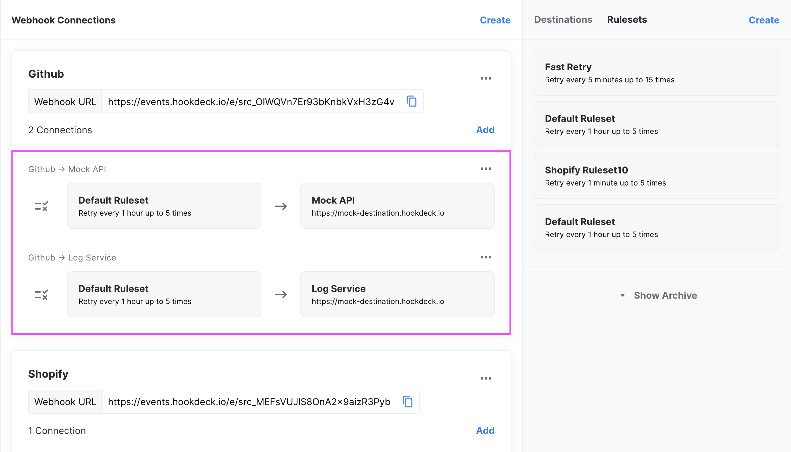
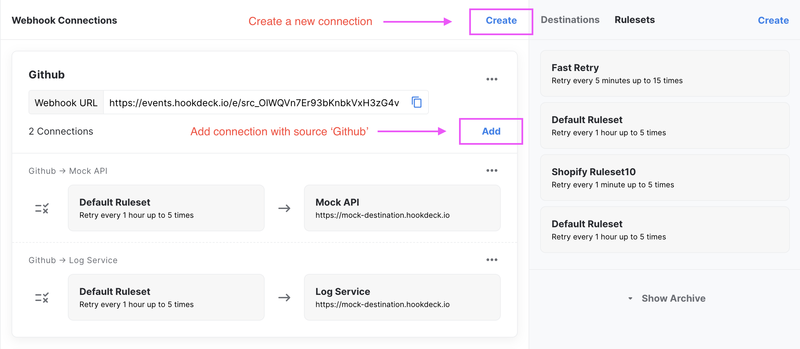
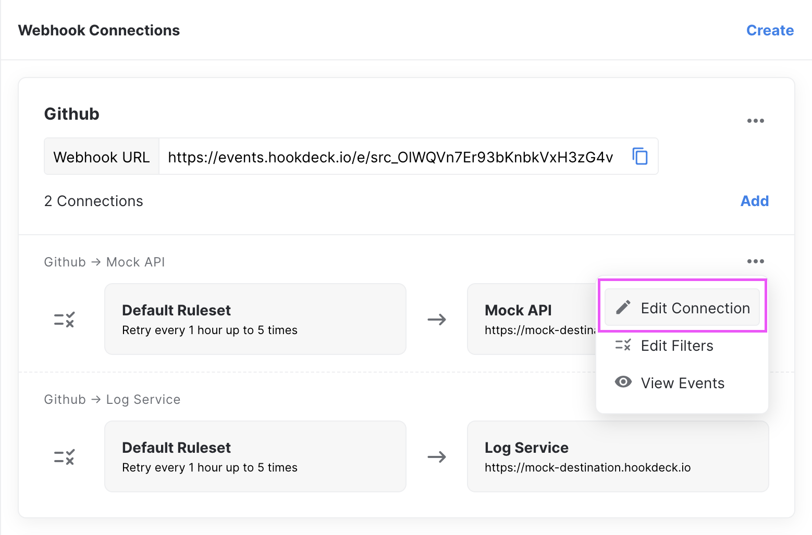

Webhook connections are used to connection a `Source` and `Destination`. By creating a connection you tell Hookdeck who will be sending you webhooks and where you wish them to be sent.

:::info
The amount of connections you cna have is limited by the pricing plan you are on. Each account, along with the free tier as 3 free connections included.
:::

## Browsing your connections

Connections are listed under the [_Connections_](https://dashboard.hookdeck.io/webhooks) page of your dashboard.

Connections are grouped by `Source` and listed bellow each of your sources.



Each connection can be individually edited, with the options menu.

## Create a connection

Connections can be create with the **_Create_** button at the top of the page or by adding a connection to a `Source` via the **_Add_** button bellow a source.



The fields for creating a new connection are:

| Field         | Description                                                          | Required |
| ------------- | -------------------------------------------------------------------- | -------- |
| `Source`      | You can select an already existing source or create a new one        | true     |
| `Destination` | You can select an already existing destination or create a new one   | true     |
| `Ruleset`     | If left empty it will default to `Default Ruleset`                   | false    |
| Label         | If left empty it will default to `Source Label -> Destination Label` | false    |
| Alias         | A human friendly unique ID to make API calls idempotent              | false    |

If your connection uses a new `Source` you will be provided with a unique URL to copy and paste in your `Source`. Otherwise, you `Source` is already setup, webhook events will now start to be sent to your configured `Destination`.

:::info
Every connection with the same `Source` uses the same URL to receive events. This means you can have a single URL to sent events to multiple destinations.
:::

:::tip
You can also use a URL specific to your `Connection` rather then your `Source` by appending your `webhook_id` to the event url -> `https://events.hookdeck.io/e/WEBHOOK_ID`. We generally do not recommend doing this but it could be useful to your use case.
:::

## Update a connection

A connection can be updated via the options menu. All properties of the connection can be updated.



:::warning
Changing your connection `Source` will also change the webhook URL since the URL is bound to the `Source` not the connection itself. If you are creating a new source, make sure to setup this new webhook URL.
:::

## Delete a connection

Currently, for technical reasons, connections cannot be deleted. We generally recommend reusing a connection that's no longer useful. The options to archive / delete webhooks will be added in a future release.

:::info
If you absolutely need a connection removed, please contact us and we will take care of it.
:::

## Best Practices

A question that often comes up is how to structure your connection. There is no 'incorrect' approach but there exist a few patterns that could best fit your use case.

### Connection per use case

You can structure your connections to map to a specific use case. For example a webhook labeled `Shopify Order → Create Gift Card` would be used to describe a webhook for the Shopify webhook topic `order/created` and put to an endpoint on your service that execute the `createGiftCard` method (ie: https://my-api.com/webhooks/createGiftCard)

Since Hookdeck provides a single URL for each `Source` you great as many destinations with that source without adding the overhead of managing multiple webhook URL.

This approach is very convinent to help you troubleshoot issues and monitor events since it gives Hookdeck more information about the context of those webhook events.

Additionally, if you are worried of getting irrelevant events to you endpoint you can also apply a filter to the connection. With out example, we could set a filter to only receive orders that contain a Gift Card.

```json
{
  "items": {
    "type": "Gift"
  }
}
```

:::tip
When in doubt, we recommend taking this approach
:::

### Connection per service

The alternative approach is to create a connection per service. You could see a connection labeled `Shopify → My API` with a destination url of `https://my-api.com/webhooks/shopify`. In this case you would handle the routing to different methods within your API based on the content of the webhook.

The benefit of this approach is that you tend to have less connections but tradeoff some granularity within Hookdeck.
