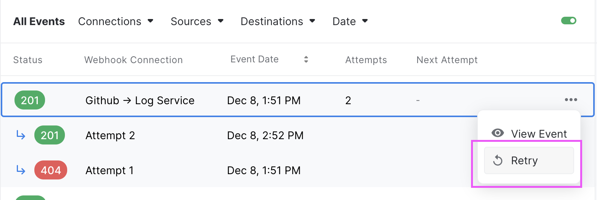
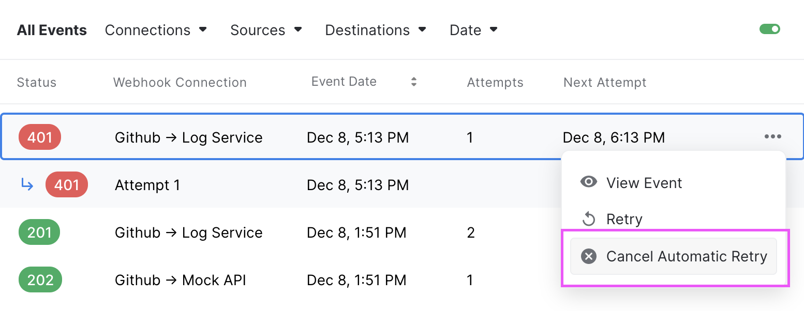

## Manual retries

Manually retrying a webhook event is useful when troubleshooting, testing, or after an update to your destination that resolved an issue.

If a manual retry is successful, the `Next Attempt At` will be cleared (if there was any). Otherwise, if the retry results in an error, the `Next Attempt At` will **NOT** be affected.

## Automatic retries

Automatic retry can be configured with a [Ruleset](rulesets) `Max Retry Count` and `Retry Interval` properties.

For each event within the Event List, you will see the `Next Attempt At` date when an automatic retry is scheduled.

## Bulk retries

Bulk retry isn't available yet via the Dashboard, it will be added in the future.

:::tip
You can retry multiple events using the API, [see how!](bulk-retries).
:::

## Cancel Scheduled Retry

A scheduled automatic retry can be canceled within the event list, the `Next Attempt At` will be unset.

