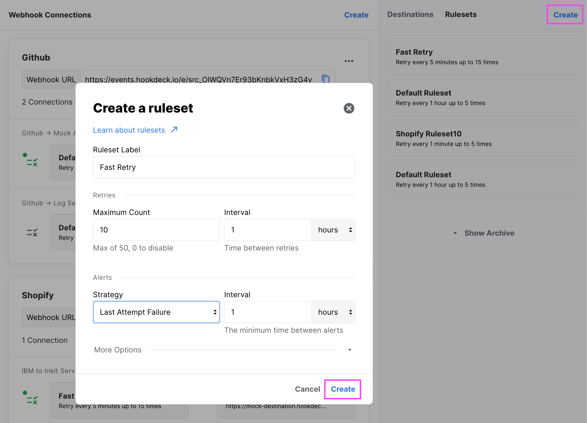
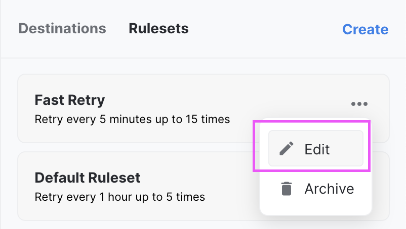
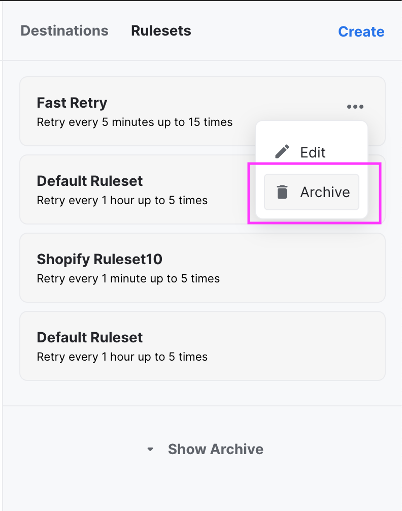
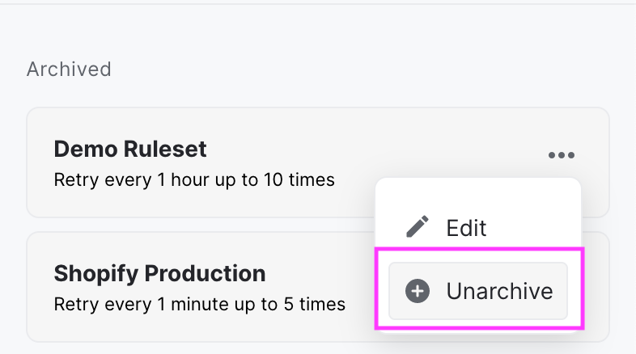

## What is a Ruleset?

A [`Ruleset`](rulesets) defines the retry logic and alert logic for your webhook connection. A Ruleset has a label, a retry strategy, and an alert strategy.

The retry logic is composed of two elements:

- The **Maximum Retry Count** is the number of automatic retries the event will attempt when there's a failure. The automatic retry stops when there's a successful event.
- The **Retry Interval** is the time interval between each one of the automatic retries.

The alert logic is composed of two elements:

- The **Alert Strategy** determines when Hookdeck's will send you alerts for failed events.
  - **Each Attempt Failure**: Send an alert as soon as an attempt fails.
  - **Last Attempt Failure**: Send an alert when the maximum retry count is reached and all previous attempts failed.
- The **Alert Interval** is the time interval between each alert.

:::note
Alerts are bound to a single webhook connection. You will receive multiple alerts from Hookdeck within the same time interval if you have failed events from different webhook connections.
:::

:::info
Each team has a `Default Ruleset` set with 5 retries every hour and an alert after the last attempt failure at most every 24 hours.
:::

## Why a Ruleset?

Part of Hookdeck value is to make sure you can recover from errors.

Controlling the retry logic means you can specify what works best for your use cases. You no longer have to rely on every API provider's different retry logic!

:::tip
You can manually retry any failed events after fixing an issue, even if your event has been attempted more times than the ruleset retry count.
:::

Receiving alerts in a timely manner results in a more proactive approach to troubleshooting. You don't need to wait for customer support to report an issue to be aware of a problem that will impact the client. Alerts contain the payload of your destination response.

## Create a Ruleset

To create a Ruleset follow these two steps:

:::tip
A new ruleset can also be created when creating a new `Webhook Connection`
:::

## Edit a Ruleset

You can edit a [`Ruleset`](rulesets) by selecting the edit button from the ruleset card options menu:

:::info
Editing a Ruleset retry strategy will only impact future event attempts. The currently scheduled next attempt time on any given event won't change until that next attempt is made.
:::

## Archive a Ruleset

You have the option to archive a ruleset you do not use anymore.

:::note
You can only archive [`Ruleset`](rulesets) that is not linked with any webhook connections.
:::

You can unarchive a Ruleset if you decide to want to use it again.

