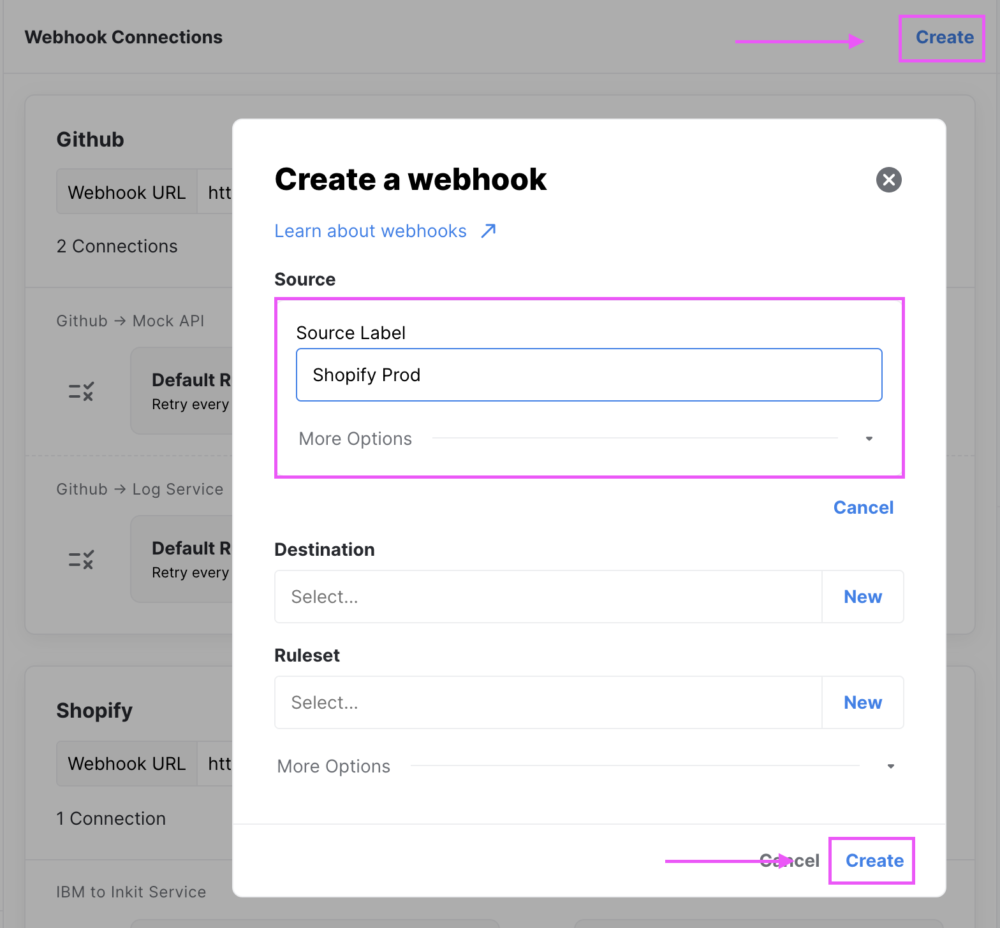
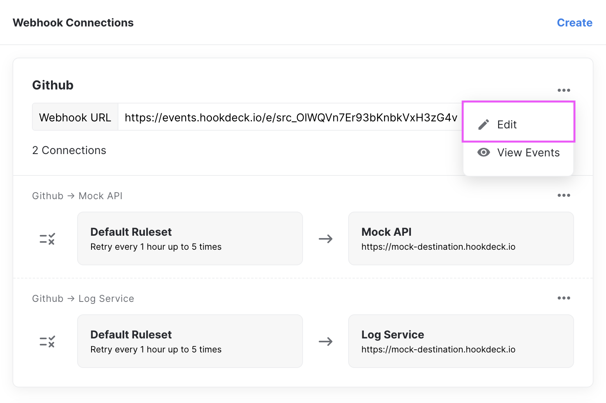

## What is a Source

A [`Source`](sources) is used to define the sender of your webhooks. Generally, this will be labeled after the platform you are using such as Shopify, Github, Intercom, etc.

Each [`Source`](sources) is associated with a Webhook URL that can be copy & paste as your URL in the sender platform.

:::note
Be as descriptive as possible, it will help you keep track of your webhook events!
:::

## Integration

Hookdeck's goal is to work with every API provider. However, we do not create integrations with specific API providers. Instead, we aim to stay fully platform agnostic while supporting as many providers as possible. As long as your API Provider supports webhooks with HTTP POST, it should be compatible.

If you encounter a problem with a specific API provider, [send us a message, we'll figure it out for you.](https://hookdeck.io/contact-us "Hookdeck Contact US")

:::warning
Some API providers require a _validation_ step. While this is not standard across all providers we do our best to implement validation for any platforms our users integrate.
:::

## Create a Source

A [`Source`](sources) can be created while creating a new `Webhook Connection`

| Field | Description                                             | Required |
| ----- | ------------------------------------------------------- | -------- |
| Label | Your API Provider name                                  | true     |
| Alias | A human friendly unique ID to make API calls idempotent | false    |

## Edit a Source

You can edit A [`Source`](sources) via the _options_ menu next to the source label.

:::note
After editing a [`Source`](sources) label, all your webhook connections with default labels will be updated to reflect the change. The webhook URL will not change by updating A [`Source`](sources).
:::

## Archive a Source

[`Source`](sources) can be archived via the API, see the API docs to learn more. This option will be added to the UI in a future release.
