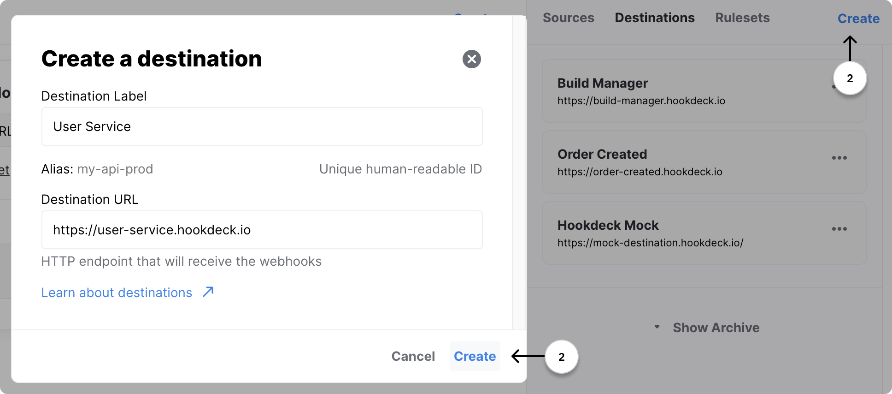
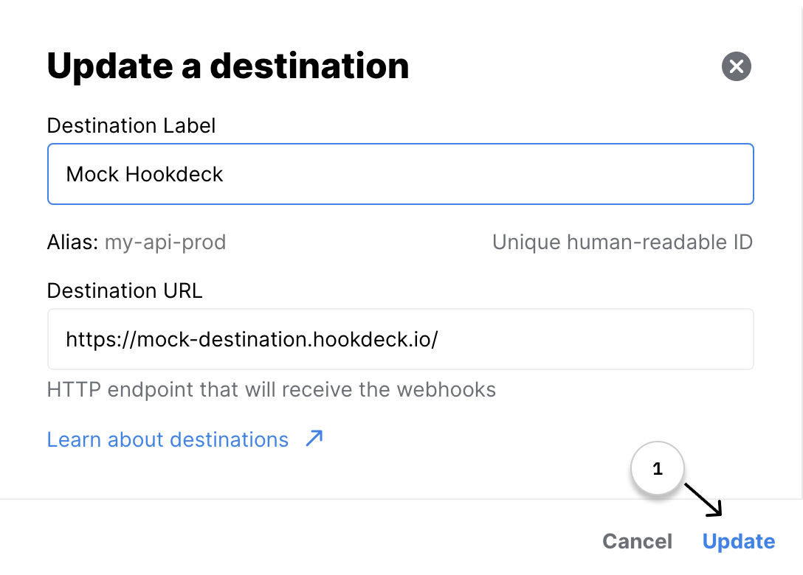
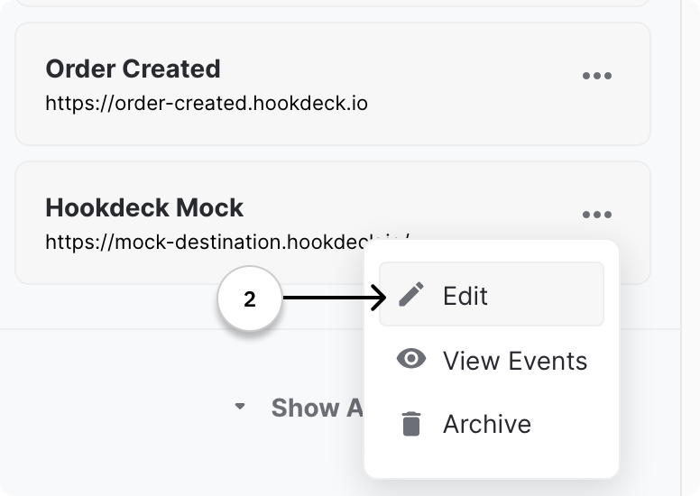
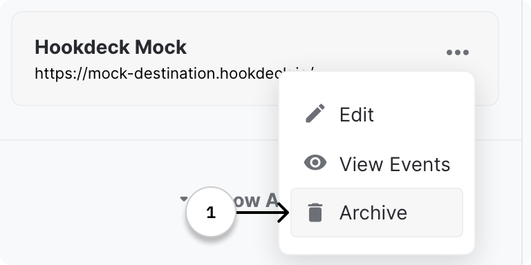
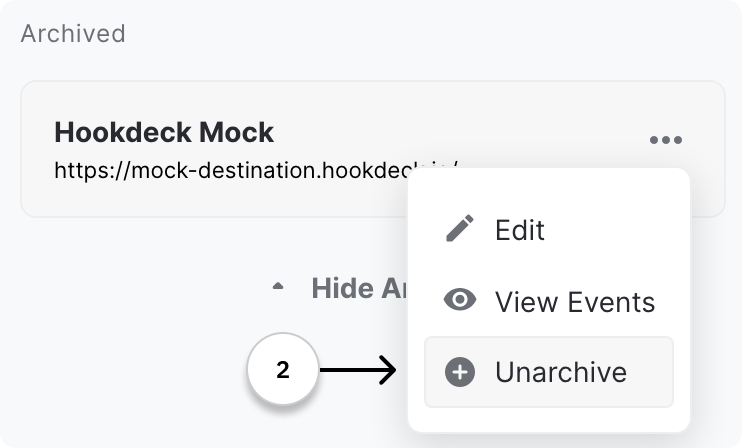

## What is a Destination?

The destination component defines the connection to your service. It is composed of two elements:

- A label
- The destination URL _(the endpoint to your service)_

## How it works

Hookdeck uses the endpoint defined in the destination to deliver your webhooks events.

## Create a Destinaton

To create a Destination follow these two steps:

## Edit a Destination

You can edit a Destination by following these two steps:

_Step 1_

_Step 2_

:::note
After editing a Destination, it will also update the Destination of linked events.
:::

## Archive a Destination

You have the option to archive a Destination you do not use anymore.

:::note
You can only archive Destination that are not linked with any webhook connections.
:::

You can easily unarchive a Destination if you decide to want to use it again.

